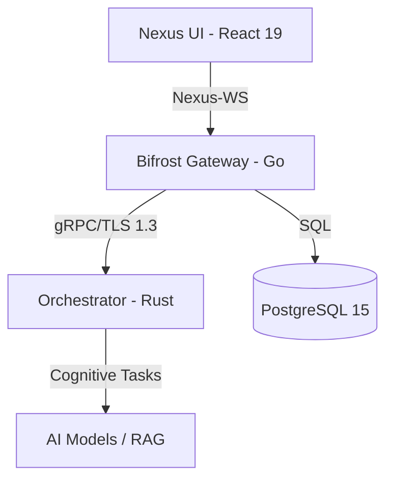

# Nox: The Distributed Cognitive Nexus 🌌

[](https://github.com/siddharth23P/nox/actions/workflows/main.yml)
[](https://opensource.org/licenses/MIT)
[](https://go.dev/)
[](https://www.rust-lang.org/)

Nox is a next-generation distributed collaboration platform designed for **high-fidelity reasoning** and **secure knowledge sharing**. It leverages a multi-service architecture with a focus on zero-trust identity and premium aesthetics.

---

## 🏗️ Architecture

Nox is built on a modular "Nexus" architecture, separating concerns between identity, orchestration, and interface.



### Core Components
- **Bifrost Gateway (`/services/bifrost`)**: High-performance Go/Gin REST & WebSocket API. Handles session management and multi-tenant isolation.
- **Orchestrator (`/services/orchestrator`)**: The "brain" of the nexus. Built with Rust/Tokio for low-latency session validation and cryptographic identity proofs.
- **Nexus UI (`/ui`)**: A state-of-the-art React application with glassmorphic design, dynamic animations (Framer Motion), and real-time state sync.

---

## ✨ Features

- **🚀 Real-time Collaboration**: WebSocket-driven messaging with persistent thread support.
- **🛡️ Zero-Trust Identity**: Granular RBAC and cryptographic session validation.
- **🎨 Premium HMI**: Sleek dark-mode interface with Tailwind CSS v4.
- **🤖 Cognitive Integration**: Deep AI orchestration for automated reasoning and summaries.
- **🔒 Secure Storage**: WORM-compliant persistence for sensitive audit trails.

---

## 🚀 Getting Started

### Prerequisites
- **Backend**: [Go 1.21+](https://go.dev/), [Rust 1.70+](https://www.rust-lang.org/)
- **Frontend**: [Node.js v24+](https://nodejs.org/)
- **Database**: [PostgreSQL 15+](https://www.postgresql.org/)

### Fast-Track Setup

1. **Clone & Install**:
   ```bash
   git clone https://github.com/siddharth23P/nox.git
   cd nox
   npm install
   ```

2. **Database Initialization**:
   ```bash
   psql -U postgres -f infra/db/schema.sql
   ```

3. **Start All Services**:
   We provide a convenience script to boot the entire ecosystem:
   ```bash
   ./restart_servers.sh
   ```

### Individual Service Launch

| Service | Directory | Command |
| :--- | :--- | :--- |
| **Bifrost** | `services/bifrost` | `go run cmd/gateway/main.go` |
| **Orchestrator** | `services/orchestrator` | `cargo run` |
| **Nexus UI** | `ui` | `npm run dev` |

---

## 📖 Usage Examples

### Authenticating via Bifrost

```bash
curl -X POST http://localhost:8080/v1/auth/login \
     -H "Content-Type: application/json" \
     -d '{"email": "admin@nox.nexus", "password": "secure-password"}'
```

---

## 🛡️ Security & Contributing

Please read our [CONTRIBUTING.md](CONTRIBUTING.md) for details on our code of conduct, and the process for submitting pull requests to us.

---

© 2026 Siddartha P. | Built for the future of distributed collaboration.
