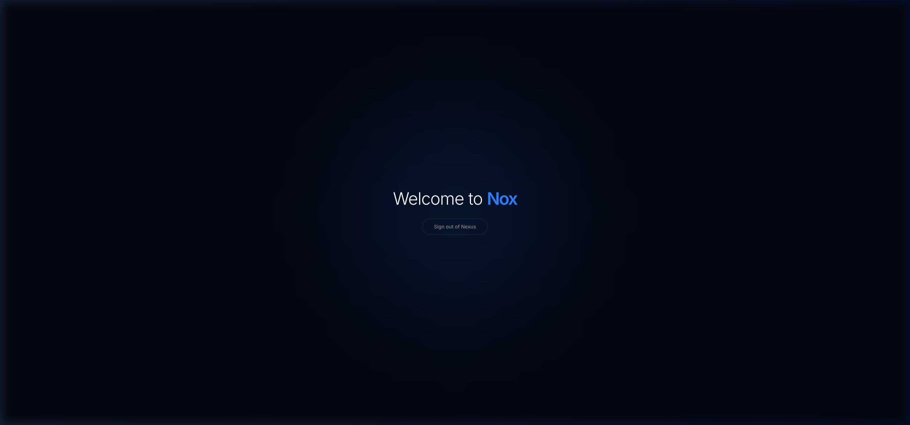

# Nox: The Distributed Cognitive Nexus 🌌

Nox is a next-generation distributed collaboration platform designed for high-fidelity reasoning and secure knowledge sharing. It leverages a multi-service architecture with a focus on zero-trust identity and premium aesthetics.



## 🏗️ Architecture Overview

The system is composed of several specialized services communicating over gRPC:

- **Bifrost Gateway (`/services/bifrost`)**: A Go/Gin-based REST API that acts as the primary ingress point for the UI. It handles authentication, organization management, and sessions.
- **Orchestrator (`/services/orchestrator`)**: A Rust/Tokio-based cognitive core that performs high-level session validation and implements Zero-Knowledge identity logic.
- **Nexus UI (`/ui`)**: A premium React application utilizing Tailwind v4, Framer Motion, and a glassmorphic design system.

## 🛠️ Tech Stack

### Backend
- **Languages**: Go (1.20+), Rust (Edition 2021)
- **Frameworks**: Gin (Go), Tonic/Tower (Rust gRPC)
- **Database**: PostgreSQL (Multi-tenant schema)
- **Security**: JWT, Bcrypt, RSA-based ZK-Proofs (Candidate)

### Frontend
- **Framework**: React 19
- **Aesthetics**: Tailwind CSS v4, Framer Motion
- **State Management**: Zustand
- **Real-time**: WebSockets (Coming soon)

## 🚀 Getting Started

### Prerequisites
- [Go](https://go.dev/) (1.20+)
- [Rust](https://www.rust-lang.org/)
- [PostgreSQL](https://www.postgresql.org/)
- [Node.js](https://nodejs.org/) (v18+)

### Local Development Setup

1. **Database Setup**:
   ```sql
   psql -U postgres -f infra/db/schema.sql
   ```

2. **Run Orchestrator**:
   ```bash
   cd services/orchestrator
   cargo run
   ```

3. **Run Bifrost Gateway**:
   ```bash
   cd services/bifrost
   export DATABASE_URL=postgres://user@localhost:5432/nox?sslmode=disable
   go run cmd/gateway/main.go
   ```

4. **Run Frontend**:
   ```bash
   cd ui
   npm install
   npm run dev
   ```

## 📈 Roadmap Progress

| Block | Status | Focus |
| :--- | :--- | :--- |
| **0. Workspace Init** | ✅ Done | Infrastructure & Dev Tools |
| **1. Auth & Identity** | ✅ Done | RBAC, OAuth, Advanced Enrollment |
| **2. Core Messaging** | 🏗️ Next | WebSockets & GFM Editor |

## 🛡️ Security
Nox follows the **Zero Trust** principle. All internal service communication is authenticated via mutual gRPC verification.

---
© 2026 Siddartha P. | Built for the future of distributed collaboration.
